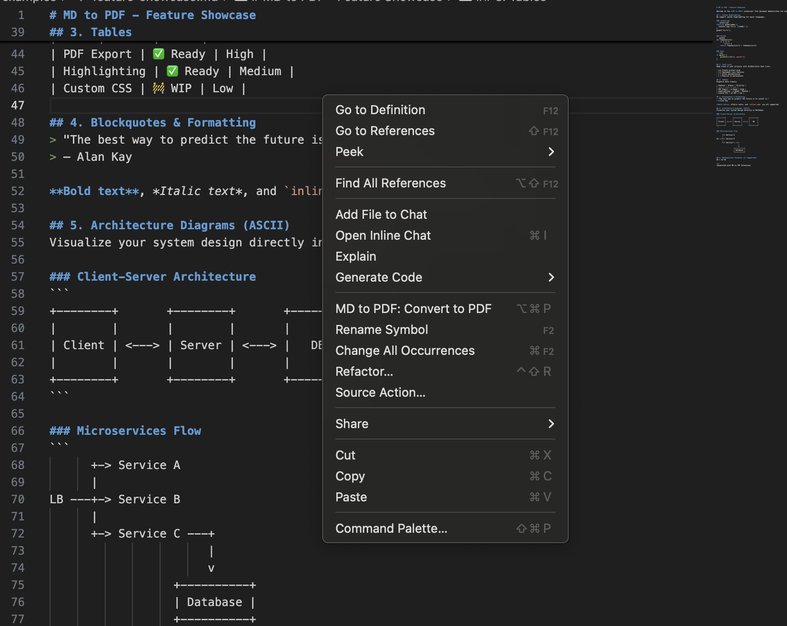

# MD to PDF - Blazing Fast ⚡

[](https://marketplace.visualstudio.com/items?itemName=good-code-solutions.md-to-pdf-blazing)
[](https://marketplace.visualstudio.com/items?itemName=good-code-solutions.md-to-pdf-blazing)
[](https://opensource.org/licenses/MIT)

Convert Markdown to PDF instantly with a single click. Beautiful GitHub-style formatting with syntax highlighting.

## ✨ Features

- **⚡ Blazing Fast** — Persistent browser instance for near-instant conversions
- **🎨 Beautiful Output** — GitHub-flavored styling with syntax highlighting
- **📊 Full Support** — Tables, code blocks, task lists, ASCII diagrams
- **🖱️ One-Click** — Convert from title bar, context menu, or status bar
- **⌨️ Keyboard Shortcut** — `Cmd+Alt+P` (Mac) / `Ctrl+Alt+P` (Windows/Linux)
- **⚙️ Configurable** — Page format, margins, and more

## 📸 Screenshots

### Preview


*See [examples/feature-showcase.md](examples/feature-showcase.md) for the source file.*


## 🚀 Usage

### Method 1: Title Bar Button
Click the **PDF** button in the editor title bar when viewing a Markdown file.

### Method 2: Context Menu
Right-click on a `.md` file in the Explorer or editor and select **MD to PDF: Convert to PDF**.

### Method 3: Status Bar
Click the **PDF** button in the status bar when a Markdown file is open.

### Method 4: Keyboard Shortcut
Press `Cmd+Alt+P` (Mac) or `Ctrl+Alt+P` (Windows/Linux) while editing a Markdown file.

## ⚙️ Settings

| Setting | Default | Description |
|---------|---------|-------------|
| `md-to-pdf.openAfterConversion` | `true` | Automatically open PDF after conversion |
| `md-to-pdf.pageFormat` | `"A4"` | Page format: A4, Letter, Legal, A3, A5 |
| `md-to-pdf.margins` | `{...}` | Page margins (top, right, bottom, left) |

### Example Configuration

```json
{
  "md-to-pdf.openAfterConversion": true,
  "md-to-pdf.pageFormat": "Letter",
  "md-to-pdf.margins": {
    "top": "20mm",
    "right": "20mm",
    "bottom": "20mm",
    "left": "20mm"
  }
}
```

## 📋 Requirements

- **VS Code** 1.85.0 or higher
- **Browser**: Chrome, Chromium, Microsoft Edge, or Brave (automatically detected)

## 🛠️ Supported Markdown Features

- ✅ Headings (H1-H6)
- ✅ Bold, italic, strikethrough
- ✅ Links and images
- ✅ Ordered and unordered lists
- ✅ Task lists (checkboxes)
- ✅ Code blocks with syntax highlighting
- ✅ Inline code
- ✅ Tables
- ✅ Blockquotes
- ✅ Horizontal rules
- ✅ ASCII diagrams

## 🐛 Known Issues

- Large files may take longer to convert
- Some custom fonts may not render in the PDF

## 📝 Release Notes

See [CHANGELOG.md](CHANGELOG.md) for release notes.

## 🤝 Contributing

Contributions are welcome! Please feel free to submit a Pull Request.

## 📄 License

This extension is licensed under the [MIT License](LICENSE).

---

**Enjoy!** If you find this extension useful, please consider leaving a ⭐️ review on the marketplace.
